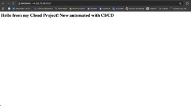

Flask App Practice

A personal project to make my own app that uses a CI/CD pipeline to deploy code automatically

Created using Flask app, Docker, GitHub Actions, Docker Hub, and an AWS EC2 instance

Functions by creating code using VS Code or Github, and pushing my changes to my automated system. It then auto builds my code, automatically pushes it, and deploys it instantaneously.

Challenges I overcame in the process were architecture mismatch, having to specify amd64 since I work from macOS. I also had to manipulate the filepath from Dockerfile, since I had organized the files differently than intended. I also fixed a security group misconfiguration as well in AWS.

Here is a screenshot of the website running in the browser, where you can also see the EC2 IP address in the search bar:

